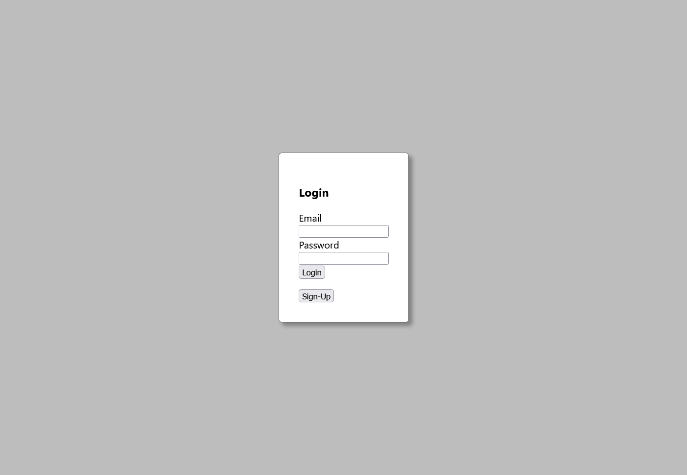
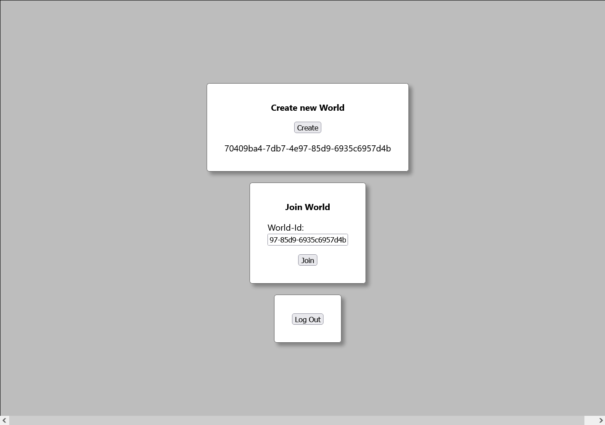
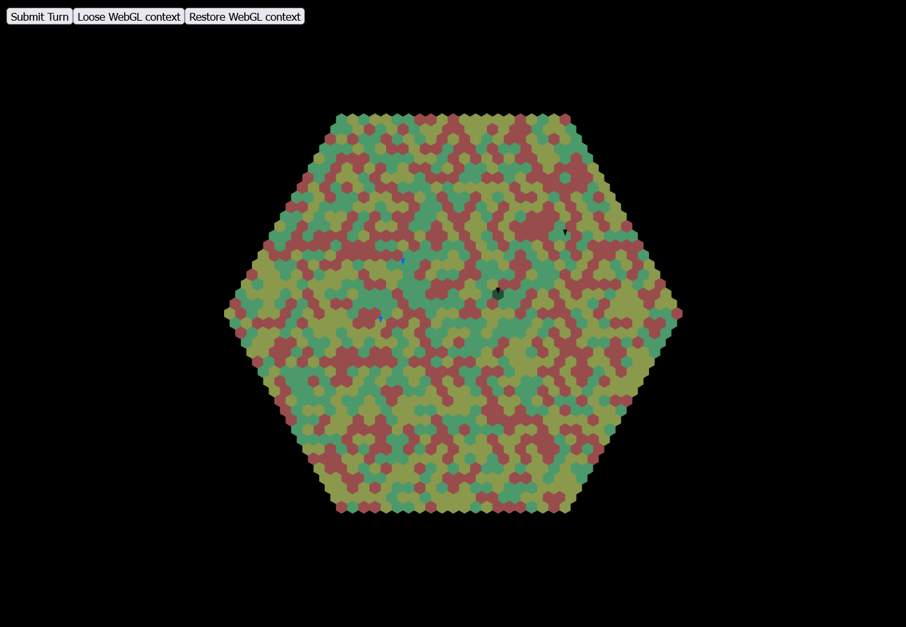

*Released: 17.05.2022*

- User Authentication/Management
    - Sign-Up
    - Log-In
    - API-Authentication

- Basic world handling
    - Create world
    - Join world by id

- Basic World-Rendering
    - tilemap rendering
    - camera-controls

- Basic turn-handling
    - submit turn
    - ends turn when all players submitted their turn
- create and automate AWS Infrastructure
- other changes and additions