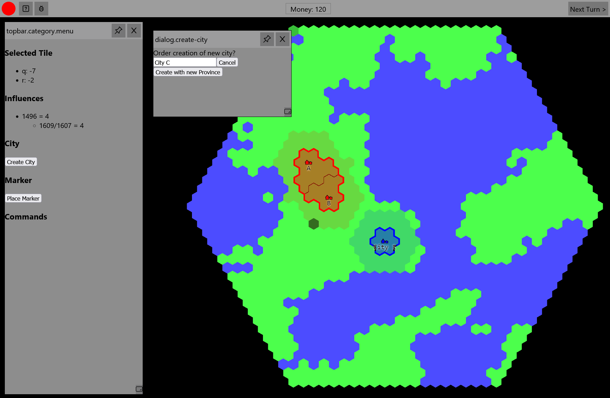

*Released: 19.08.2022*

- Basic Ingame UI
    - dialog/window System
    - contains first gameplay functionalities and some debug features 
- World Generation
    - basic world generation with two tile types (land, water)
- Rendering
    - render objects with textures
    - render cities with labels
    - render two types of borders (country-border, province-border)
- Cities and Provinces
    - Create new cities with provinces if some basic requirements are fulfilled
    - Cities generate fixed amount of income each turn
    - Cities define country border based on influence in tile
- Persistence
    - Persists all game data in database
- Add Swagger-UI for Backend API
- Add React-Storybook for UI-Component development
- other changes and additions