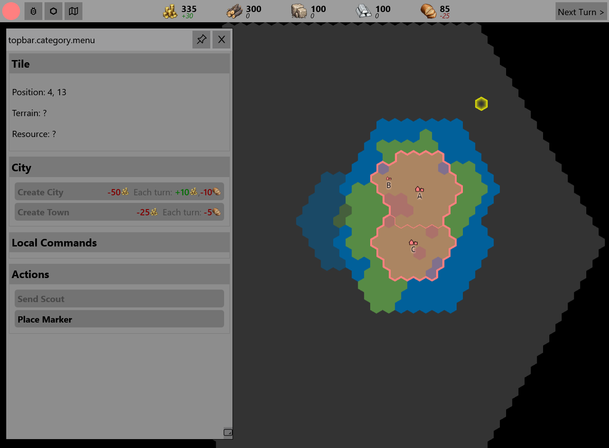
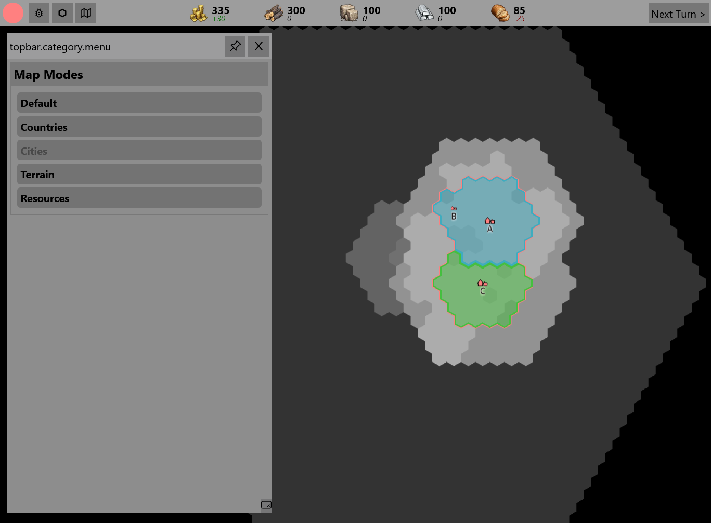
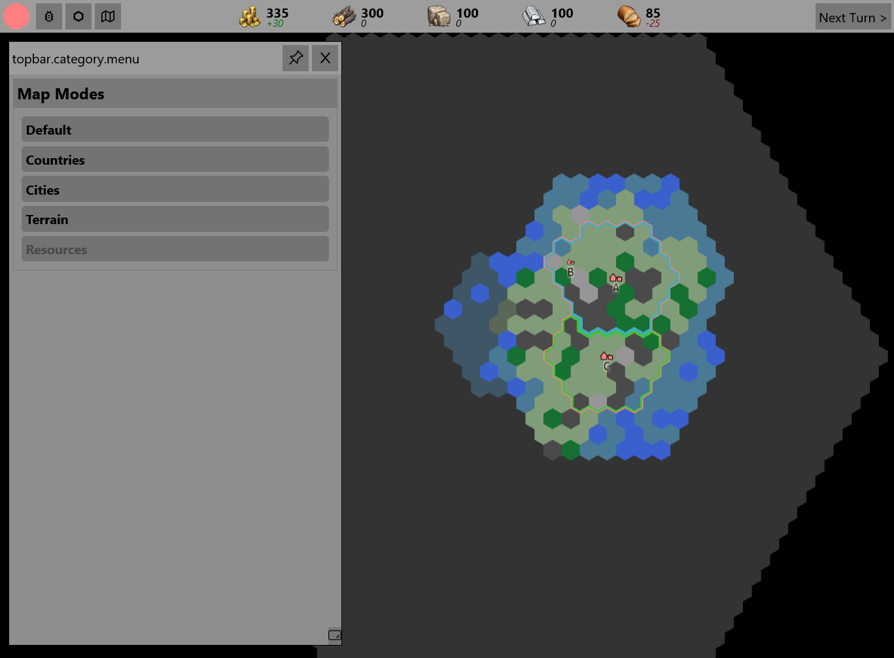

*Released: 05.11.2022*

- Visibility System
    - "unexplored", "explored", "visible"
    - game-elements (e.g. tiles, cities, ...) expose different data based on current visibility
    - tiles get explored / are visible based on owner, distance to cities and scouts 
- Map-Modes
    - world-map display different information based on currently selected mode
    - 
    - 
- Added resources (wood, stone, metal, food)
    - location of sources generated procedurally
- Added buildings to cities
    - Lumber Camp (wood), Quarry (stone), Mine (metal), Harbor (food), Farm (food)
    - a limited amount of buildings can be built in each city/town
    - buildings generate resources based on available tiles
- Remove Provinces
    - regions are only based on cities
    - hierarchy: country -> cities -> towns
- Improved tile ownership system
- general ui improvements
- technical improvements
    - introduce dependency injection in backend and frontend
    - dockerize complete backend/infrastructure
    - introduce monitoring (grafana, kibana, custom embedded log-viewer)
    - switch ktor to ssl -> drop aws application load balancer
- other changes and additions
