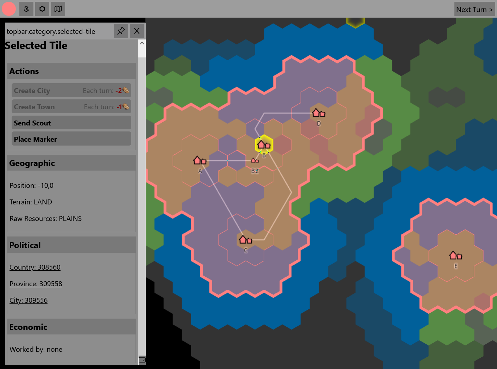

*Released: 19.03.2023*

- Economy System
    - resources are stored locally (in provinces)
    - implement and refine basic production chains
    - improved (standardized) resource life-cycle (consume from last turn, produce for next turn) 
    - provinces can be automatically connected via routes to form economic areas
    - resources are shared between provinces in same network/economic areas
- UI-Improvements
    - separate and improved windows/menus for tiles, cities, provinces, ...
- option to specify world seed when creating a new world
- (admin) endpoint to disconnect all currently connected players from all games
- technical improvements
    - migration to kubernetes
    - improved environment variable handling
    - event/trigger based turn resolution
    - miscellaneous backend cleanups
- other changes and additions