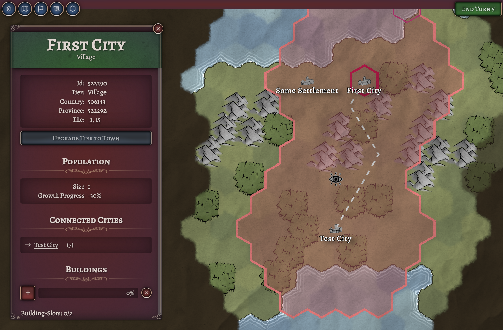
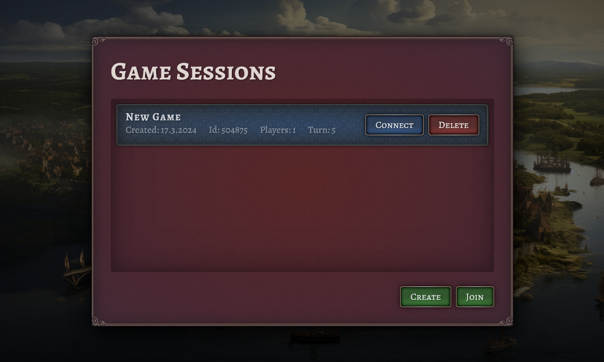

*Released: 13.04.2024*

- reworked UX and  UI
    - proper login, join-game, and ingame-pages
    - complete rework of ingame ui-structure and design
    - introduce common design language and layout with reusable ui components
    - improved world rendering
- improved handling of authentication tokens
- improved client-side data storage
- re-built renderer
- upgrade to vite 5
- other technical improvements and refactorings