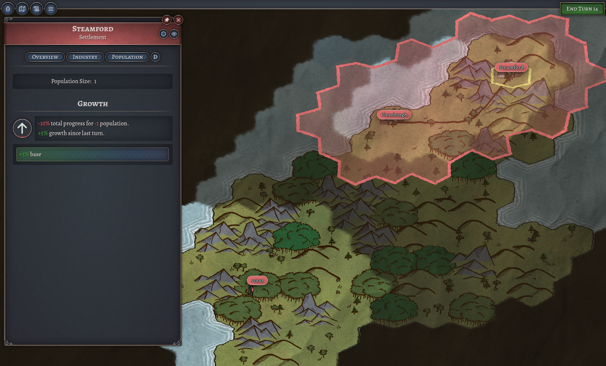
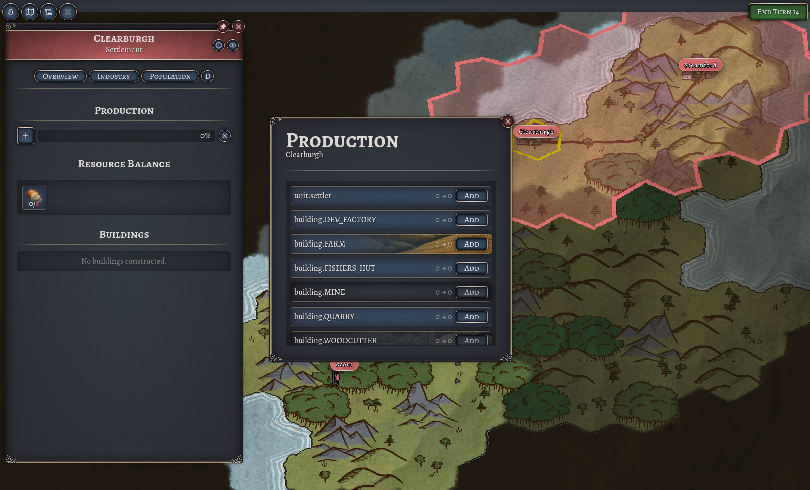
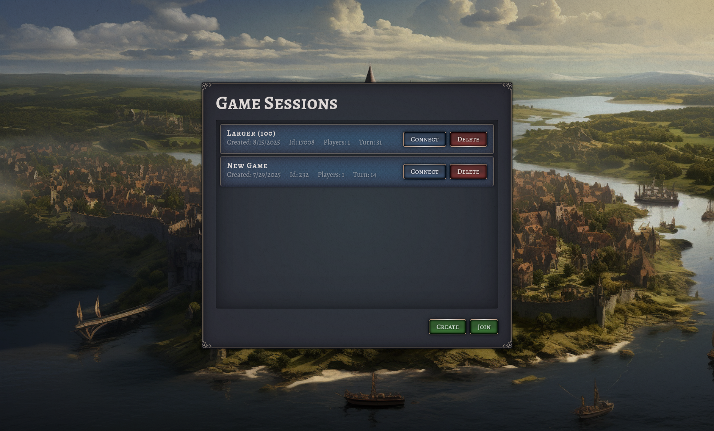

*Released: ???*

- Re-Built and simplified basic gameplay loop
	- visibility and scouts
	- settlers and settlements
	- economy, network and trade
	- production queue
	- buildings
	- population growth and decline
	- terrain and tile ownership

- reworked UI and UX
- moveable units (scout, settler)
- improvemed camera controls
- improved UI design and map graphics

**Infrastructure**

- replaced ELK with Loki+Grafana for log monitoring (more lightweight)
- overhauled monitoring dashboards
- overhauled deployment of docker stack to aws ec2

**Backend Architecture**

- refactor and cleanup architecture
- switch to multimodule project
- improved error handling
- inline value classes for object ids for more type safety

**Frontend Architecture**

- refactor and cleanup architecture
- overhaul renderer
	- introduce render graph (define rendering behavior as connected nodes)
	- perform performance intensive tasks using WebAssembly

- and more ...