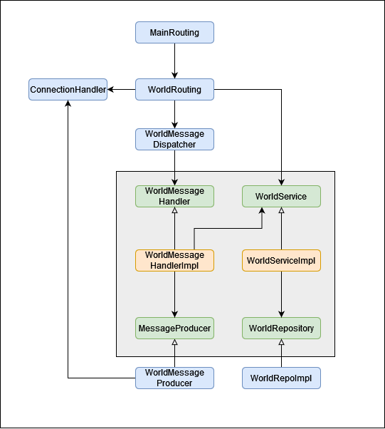

"Inspired" by "Hexagonal Architecture"

- core = yellow: actual business logic
- ports = green: interfaces,models for required/provided services, no logic (technically still part of core)
- external = blue: external services, e.g. db, http-controllers, ... 

