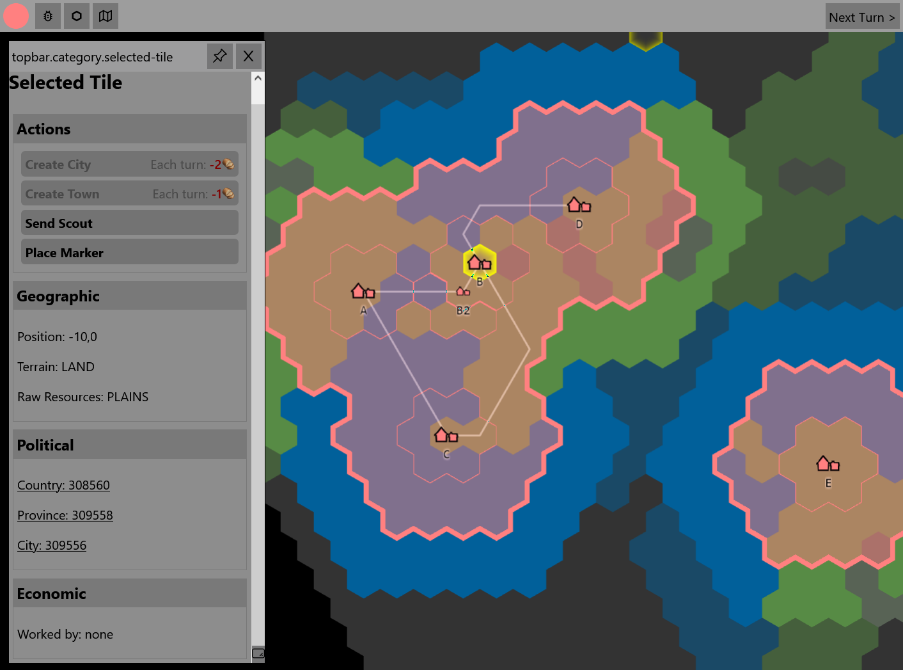
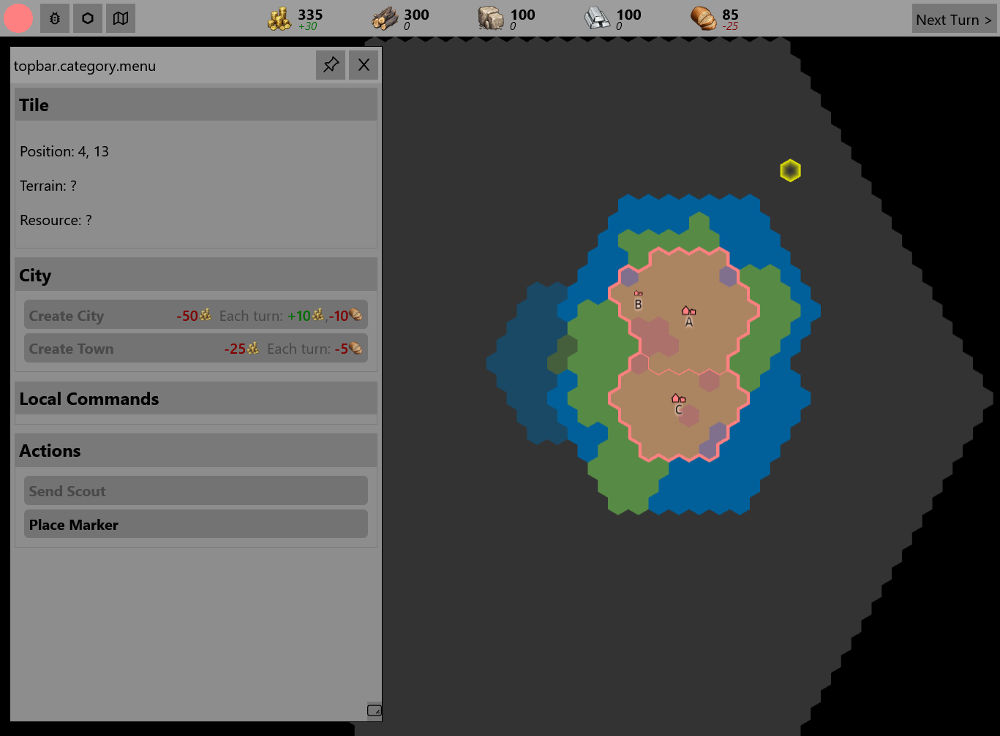
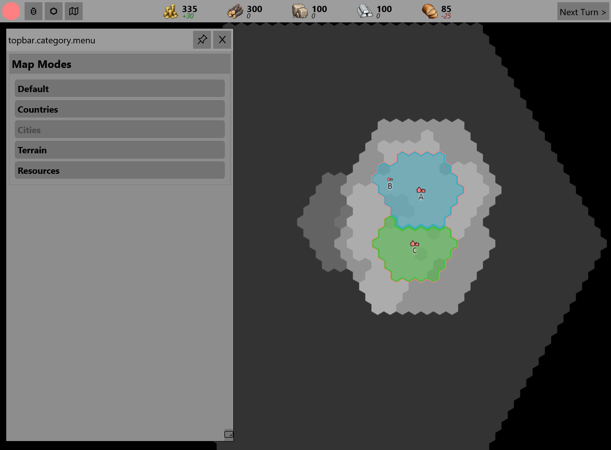
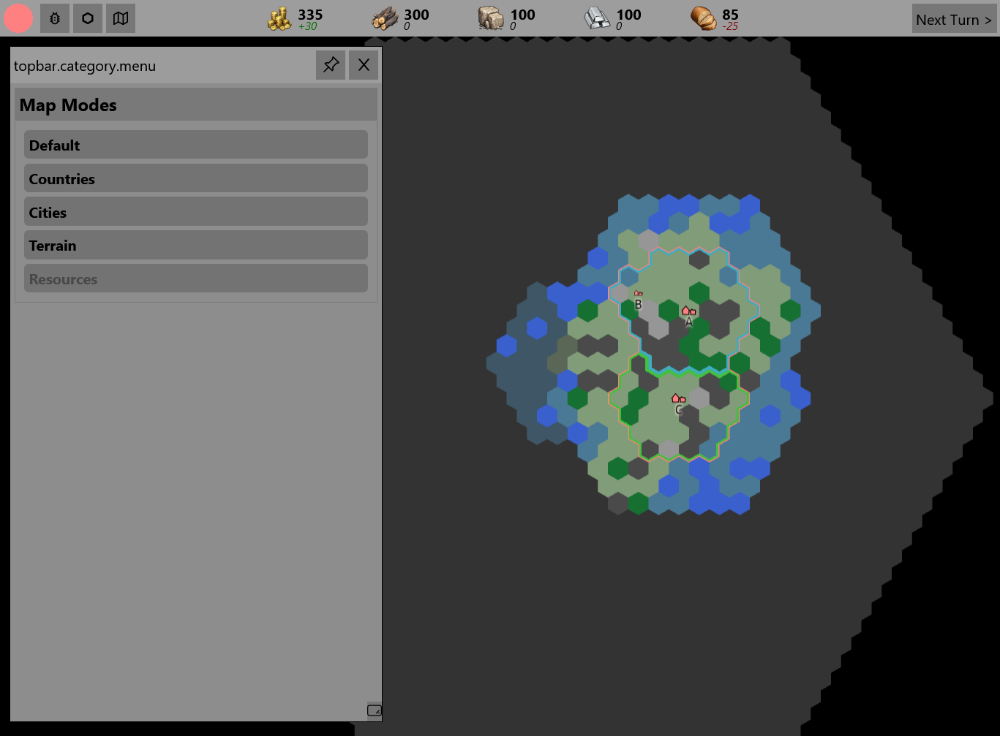
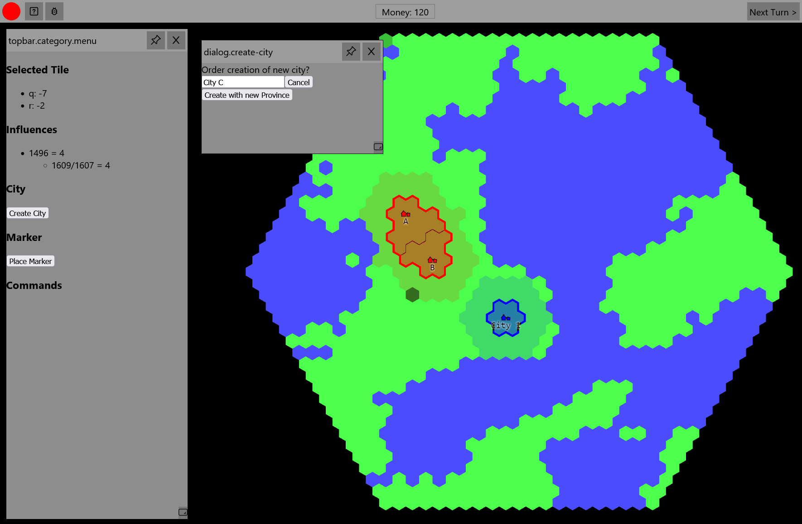
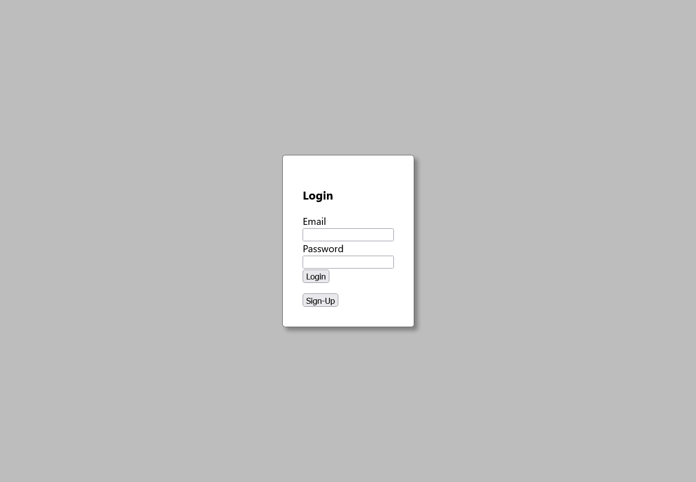
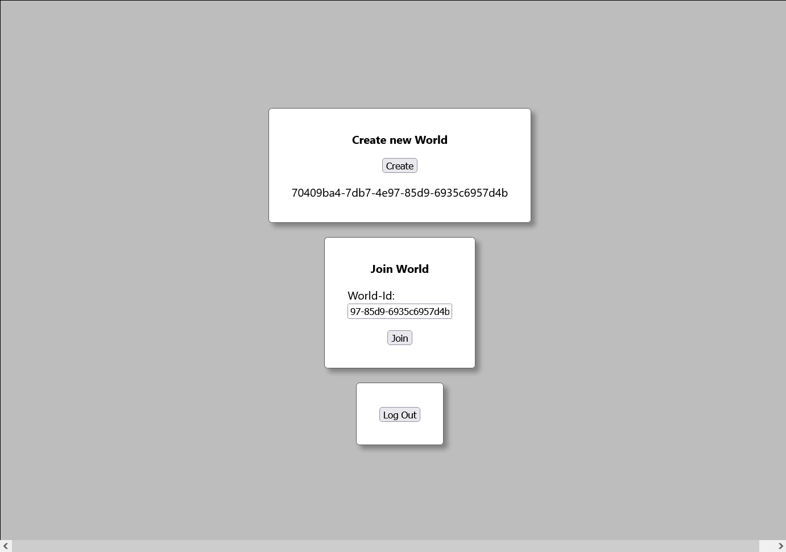
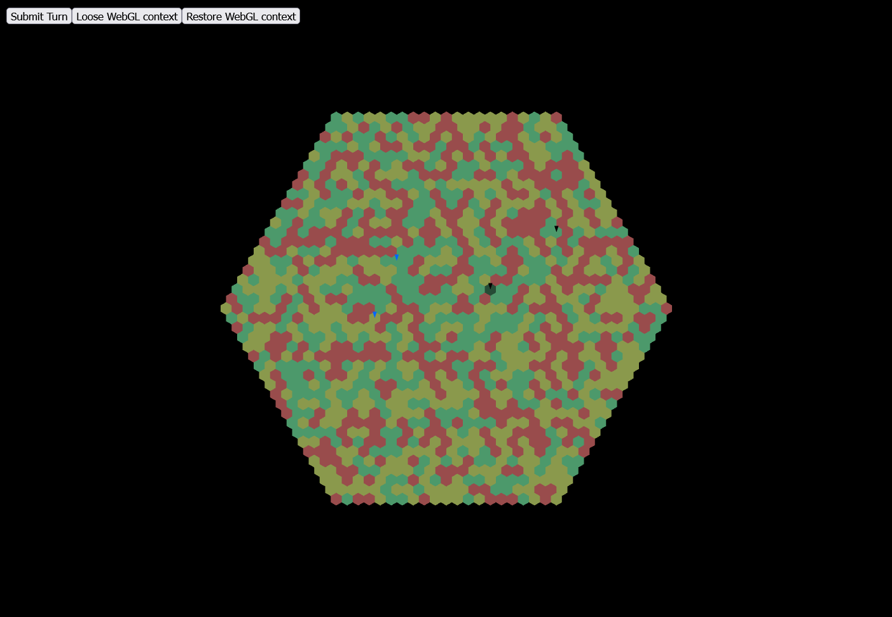

# Version 0.5.0 - 01.08.2023

- Cities

  - creation requires settlers in country
  - production queue for buildings and settlers
  - production queue consumes required resources until satisfied
  - attribute "size" and "tier"
  - city-size grows/shrinks based on multiple factors
  - (first) preview of city during its creation in ui
- config for docker-swarm on aws ec2
- refactor backend -> vertical slices

# Version 0.4.0 - 19.03.2023

- Economy System
  - resources are stored locally (in provinces)
  - implement and refine basic production chains
  - improved (standardized) resource life-cycle (consume from last turn, produce for next turn) 
  - provinces can be automatically connected via routes to form economic areas
  - resources are shared between provinces in same network/economic areas
- UI-Improvements
  - separate and improved windows/menus for tiles, cities, provinces, ...
- option to specify world seed when creating a new world
- (admin) endpoint to disconnect all currently connected players from all games
- technical improvements
  - migration to kubernetes
  - improved environment variable handling
  - event/trigger based turn resolution
  - miscellaneous backend cleanups
- other changes and additions

# Version 0.3.0 - 05.11.2022

- Visibility System
  - "unexplored", "explored", "visible"
  - game-elements (e.g. tiles, cities, ...) expose different data based on current visibility
  - tiles get explored / are visible based on owner, distance to cities and scouts 
- Map-Modes
  - world-map display different information based on currently selected mode
  - 
  - 

- Added resources (wood, stone, metal, food)
  - location of sources generated procedurally

- Added buildings to cities
  - Lumber Camp (wood), Quarry (stone), Mine (metal), Harbor (food), Farm (food)
  - a limited amount of buildings can be built in each city/town
  - buildings generate resources based on available tiles
- Remove Provinces
  - regions are only based on cities
  - hierarchy: country -> cities -> towns
- Improved tile ownership system

- general ui improvements
- technical improvements
  - introduce dependency injection in backend and frontend
  - dockerize complete backend/infrastructure
  - introduce monitoring (grafana, kibana, custom embedded log-viewer)
  - switch ktor to ssl -> drop aws application load balancer
- other changes and additions

# Version 0.2.0 - 19.08.2022

- Basic Ingame UI
  - dialog/window System
  - contains first gameplay functionalities and some debug features 
- World Generation
  - basic world generation with two tile types (land, water)
- Rendering
  - render objects with textures
  - render cities with labels
  - render two types of borders (country-border, province-border)
- Cities and Provinces
  - Create new cities with provinces if some basic requirements are fulfilled
  - Cities generate fixed amount of income each turn
  - Cities define country border based on influence in tile
- Persistence
  - Persists all game data in database
- Add Swagger-UI for Backend API
- Add React-Storybook for UI-Component development
- other changes and additions

# Version 0.1.0 - 17.05.2022

- User Authentication/Management
  - Sign-Up
  - Log-In
  - API-Authentication

- Basic world handling
  - Create world
  - Join world by id

- Basic World-Rendering
  - tilemap rendering
  - camera-controls

- Basic turn-handling

  - submit turn
  - ends turn when all players submitted their turn

- create and automate AWS Infrastructure

- other changes and additions

  