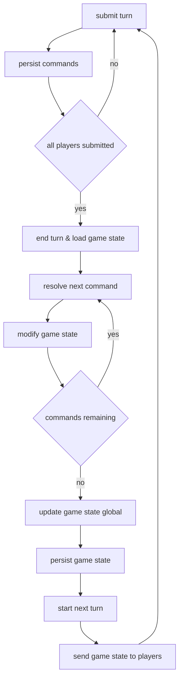

# Game Turn

```mermaid
flowchart TD
    A[submit turn] --> B[persist commands]
    B --> C{all players submitted}
    C -->|no| A
    C -->|yes| D[end turn & load game state]
    D --> E[resolve next command]
    E --> F[modify game state]
    F --> G{commands remaining}
    G -->|yes| E
    G --> |no| H[update game state global]
    H --> I[persist game state]
    I --> J[start next turn]
    J --> K[send game state to players]
    K --> A

```

